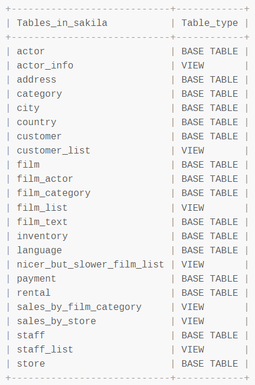

# Sakila database

## what is this ?

This repo aims at providing students with a working install of [the famous Sakila database](https://dev.mysql.com/doc/sakila/en/sakila-preface.html), and other databases, so they can train making complex queries or even build software backed by the data present in the db.

As a good practice, if you're building an app' on top of one the test databases, you should create a dedicated user for it with restricted rights to that db only.

## pre requisites

- have a working install of MySQL server

## databases

### a generic dockerized SQL Server Express 2019 database instance

- you can connect with MSSMS, or any other tool, using login/password auth (the root username would be `sa`)

### Sakila

This database implements the data structure of a DVD rental store (quite vintage huh ?).

#### install

##### Docker install

- `docker compose -f ./docker/sakila.docker-compose.yml up`
- db host name is `db`, root user has `root` password
- to create the db => `docker exec -i sakila-db-1 sh -c 'exec mysql -uroot -proot' < sql/sakila/sakila-schema.sql`
- to seed the db => `docker exec -i sakila-db-1 sh -c 'exec mysql -uroot -proot' < sql/sakila/sakila-data.sql`

##### non-Docker install

- `mysql -u root -p` to enter the MySQL shell
- once inside the shell: `SOURCE {path_to}/sakila-schema.sql` (replace `{path_to}` by the actual path to your SQL script, without the curly braces of course)
- then proceed with a `{path_to}/sakila-data.sql`
- still in the MySQL shell you can then `USE sakila;`

##### check that database is properly seeded

- `SHOW FULL TABLES;` should show you this output: 
- if you run a `SELECT COUNT(*) FROM film;` you should have a 1000 rows
